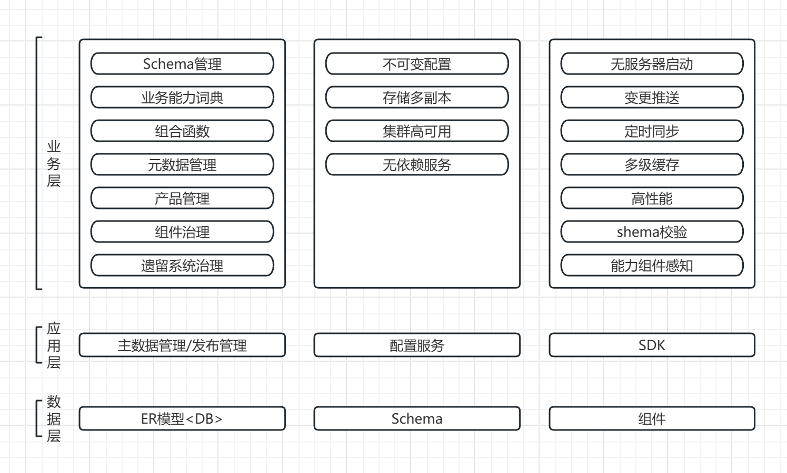
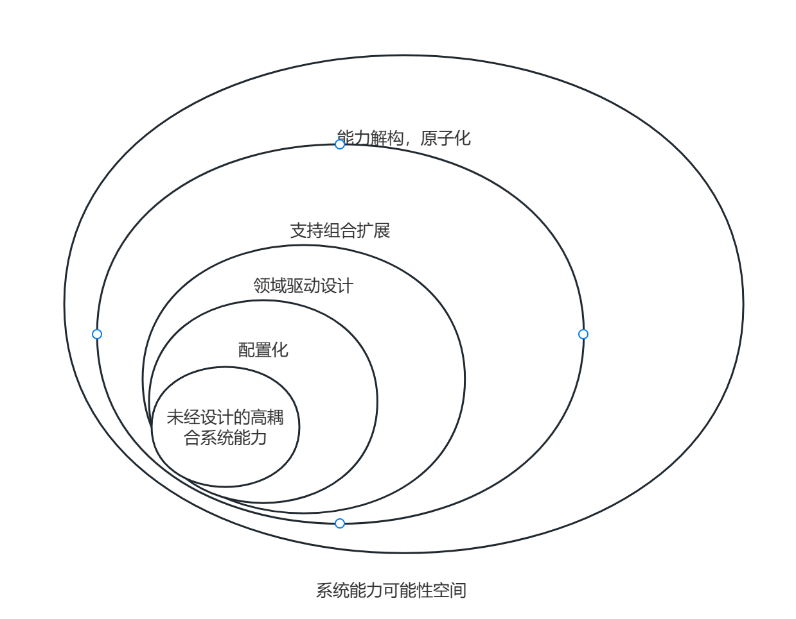
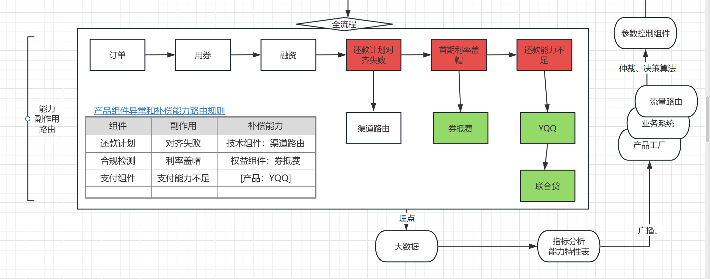

# 简要介绍

这个项目是在LX（公司）的时候，老板提出要做（抄）的东西。

**期望实现"无需代码变更，配置化实现业务需求"。**

参考了10+厂商的系统，总结大概3个思路

    1，第一种思路是挂羊头卖狗肉
    
    把原来N个功能模块（例如账务，交易，请结算，计费……）合并到一个系统来配置，
    重新起个名字“产品工厂”
    
    这个是比例最大的。大概占据了50%

    2，第二种思路是低代码
    一般是提供了2套组件：可视化表单编辑，流程编排。
    
    这种，做不了复杂的业务。
    
    3，第三种思路是特化apollo
    
    用apollo这个成熟的配置中心，增加针对业务场景优化的UI。
    
    ————算不上什么有意义的方案
    
    

分析下来，这三种思路没有一个能解决我们的需求

    1，技术债的根本在应用，而不在配置层。是应用层
        
        1.1 不是配不出来，是应用这边代码质量太差。
        1.2 各种配置可视化平台，本质上是把配置人员从开发转为业务，而且只是针对部分场景，
            复杂的场景，还是需要开发支持。实际情况演化下来很可能还是业务张嘴，开发动手   
            解决不了根本问题
    
    2，从建行的经验看https://max.book118.com/html/2018/0303/155601577.shtm
        即使建成
    
        2.1，只不支持突破性的创新，仅支持产品模型定义的那几种变化
                
    
    
**3，我认为真正可行的思路：
        
        关键矛盾在应用，所有的应用，其架构不外数据流处理系统。腐化的关键问题是
        1，无法快速梳理清楚业务流程
        2，无法快速明晰业务流程中的各种变化
            
这两个问题，在技术上其实都有解决方案的
        
        1，采用流程编排组件，整体流程 一目了然。流程科编排，可动态发布，风险可控
        2，规范化业务词典功能，各个业务各个业务变化一目了然
 
    
产品工厂在哪？
        
        其实，各种分析下来，感觉没有什么特别有价值。 
        
        自从05年IBM鼓吹这个概念来，所以到现在没有看到很好的实践。
    
        所以，这个项目做了一半我也想废弃了。
    
但也有一些特别之处（好玩的地方）
    
        我们采用的是方案3（特化apollo）
        6.1 我们重写了一个更好的apollo
        6.2 不过没有直接服用apollo的代码，他代码太冗余了
            6.2.1 他绑定了eureka，我采用的方式类似spring-cloud，定义接口而不实现，通过starter扩展适配
            6.2.2 代码上耦合了servlet协议，我采用的方式是接口开发，原因同上
            6.3.3 IOC上他使用了Guice，我采用的是向下IOC（依赖注入JVM容器），引入的组件更少
            6.3.4 元数据页面插件化解耦，可灵活扩展。

        所以基本上，用1/100甚至更少的代码实现了更好的扩展性和清晰度。
        ……
        
        上面都是一些技术的玩意，有意思也没意思（在业务看起来没有价值，但是比较容易适配各种基础设施）
    
        在业务上的创新是
        6.3 采用了产品，要素，能力，组件的四级抽象
        6.4 提供组合策略，实现能力可组合式扩展
        6.5 提供了schema来规范应用代码实现，通过产品工厂提升应用质量
        6.6 提供了副作用视图机制，通过产品工厂提供业务能力关系和路由视图，帮助产品针对性创新
    

# 模块和分包介绍

    pf-admin    //前台页面
        matadata        //元数据管理
        publish         //发布管理
        approve         //审批平台集成
        
    pf-admin    //产品增删改，发布流程审批等
        
    pf-server   //产品配置服务平台（高可用，高性能）
        
    pf-sdk      //配置推拉，无服务器启动
        sdk
            localRepository //本地存储
    pf-api      //接口 通用包
        schema      //产品要素schema定义
        function    //组合函数定义
        metadata    //元数据源定义
        api         //元数据源定义
            client、server、admin 接口定义

    

# 